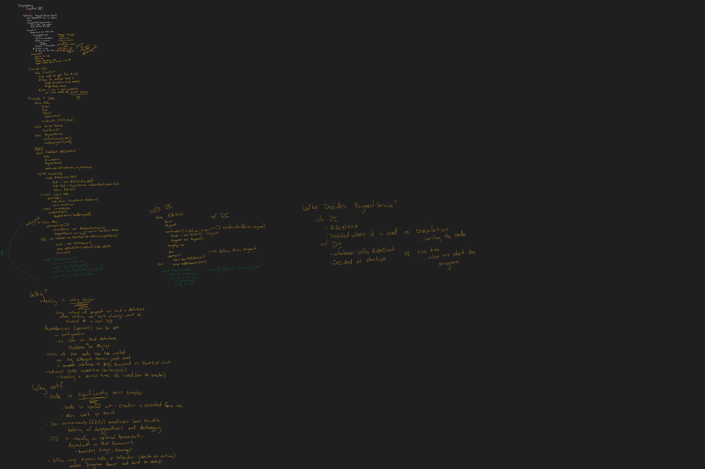

# Dependency Injection

Note: Dependency Injection is a hard concept to understand. If this is your first time learning about DI it may not make sense this time around- that’s okay. You may need to go through a few different explanations until able to sort it out.



## Resources

### General resources

<https://en.wikipedia.org/wiki/Dependency_injection>

<https://www.martinfowler.com/articles/injection.html>

### Javascript Resources

<https://openbase.com/categories/js/best-javascript-dependency-injection-libraries>

<https://medium.com/analytics-vidhya/dependency-injection-in-javascript-with-no-libraries-8ad1aba74fbd>

### Python Resources

<https://wasinski.dev/comparison-of-dependency-injection-libraries-in-python/>

<https://github.com/ets-labs/python-dependency-injector>

## Definition

A technique where a function or object receives the services it depends on from an external source instead of calling them directly.

### Example - Getting a Taxi

#### Problem

##### Traditional Taxis (w/o DI)

- Research taxi services
- Check company website and get information about pricing and availability (or call, but we want a common interaction interface)
- Decide on a service and request a driver
- Take taxi ride
- Pay for the ride w/ cash or credit card

##### Rideshare (Uber, Lyft) (w/ DI)

- Open up the app
- Tell the app where I’m going, check the pricing, and wait times
- Wait for the app to find me a driver
- Take “taxi” ride
- App handles payment to the driver

#### Psuedocode

```C#
class Ride {
    Car
    Driver
    Cost
    Pickup
    Dropoff

    constructor(pickup, dropoff) {
        Pickup = pickup
        Dropoff = dropoff
    }
}

class DriverService {
    findDriver()
}

class PaymentService {
    calculateCost(pickup, dropoff)
    handlePayment(cost)
} 

//API
class RideClient : APIEndpoint {
    Ride
    DriverService
    PaymentService

    constructor(driverService, paymentService) {
        DriverService = driverService
        PaymentService = paymentService
    }
    
    //HTTP ./createRide
    createRide(pickup, dropoff) {
        this.Ride = new Ride(pickup, dropoff)
    }

    //HTTP ./startRide
    startRide() {
        Ride.Driver = DriverService.findDriver()
        Ride.Cost = PaymentService.calculateCost(Ride.pickup, Ride.dropoff)
        return Ride
    }
    
    //HTTP ./completeRide
    completeRide() {
        PaymentService.handlePayment(Ride.cost)
    }
}

class Main {
    startup(args[]) {
        driverService = new RideshareDriverService() // inherits from DriverService
        paymentService = new RideshareDriverService() //inherits from PaymentService
        rideService = new RideClient(driverService, paymentSerivce())
        
        server = new HTTPServer()
        server.addController(rideService) //create API endpoints matching the class methods
        server.start()
    }
}
```

#### Components

- Service - taxi ride
- Client - me
- Interface - website, app, or phone call
- Injector - Rideshare service

#### Advantages

- Makes unit testing significantly easier since you can create mock dependencies instead of trying to override them ← this one is the most noticable

- Dependencies can be set up using configuration instead of code.
- Reduces boilerplate
- Different teams can work on different parts of the code in isolation- they only need to agree on a common interface. Example - calling an API created by a different company or individual. Changes to your code are fully independent of any changes the - API makes to its back end.

#### Disadvantages

- Makes code significantly more complicated
- Finding the different parts of a process means a lot of jumping around
- More work upfront to setup and configure DI
- Development environments may have a harder time helping you write and debug your code
- DI is often implemented using an external framework. This creates reliance on that framework.
- It often requires dynamic programing or reflection, making a program slower to run overall

## Related Terms

### Inversion of Control

(Dependency Inversion Principle)

Coding principle that a client should not need to decide on what implementation of a service it should use. Dependency injection is an implementation of this principle. 

<https://en.wikipedia.org/wiki/Inversion_of_control>

### Single-Responsibility Principle

Each function, object, or class should only handle one part of a program’s execution.

<https://blog.cleancoder.com/uncle-bob/2014/05/08/SingleReponsibilityPrinciple.html>

### Loose Coupling

Part A of a program makes use of part B, but doesn’t depend on it directly. If part B was swapped for part C then there would be minimal if any changes to part A.

Example: API calls are independent of the service behind them. You can change the implementation of an API endpoint without clients having to change their code.

<https://www.brainspire.com/blog/what-is-loose-coupling-why-does-it-matter-for-your-new-project>

### Unit Testing

A test that checks a single unit or function to ensure that it behaves as expected. This works in conjunction with integration and end-to-end tests that verify how different parts of a system work together.

<https://martinfowler.com/bliki/UnitTest.html>

### Mocks, Fakes, and Stubs

Specific definitions for each term vary, but essentially these are components used in testing to replace dependencies. An example would be replacing a database dependency with a fake one.

<https://en.wikipedia.org/wiki/Mock_object>

### Boilerplate

Code that gets used over and over again without making any changes. Ex. having to create an instance of a service every single time when not using something like a DI container

### Dynamic Programing/Reflection

Allows you to make decisions about how a given function, class, object, service, etc. will function when the program is running instead of while you are writing the code. Makes programs more flexible at the cost of debugging and makes the program run slower.

<https://dev.to/designpuddle/coding-concepts---reflection-4d2c#>

### Dependency Injection Container

Implemented by some DI frameworks, creates a container that holds different services so that they can easily be added to clients.
