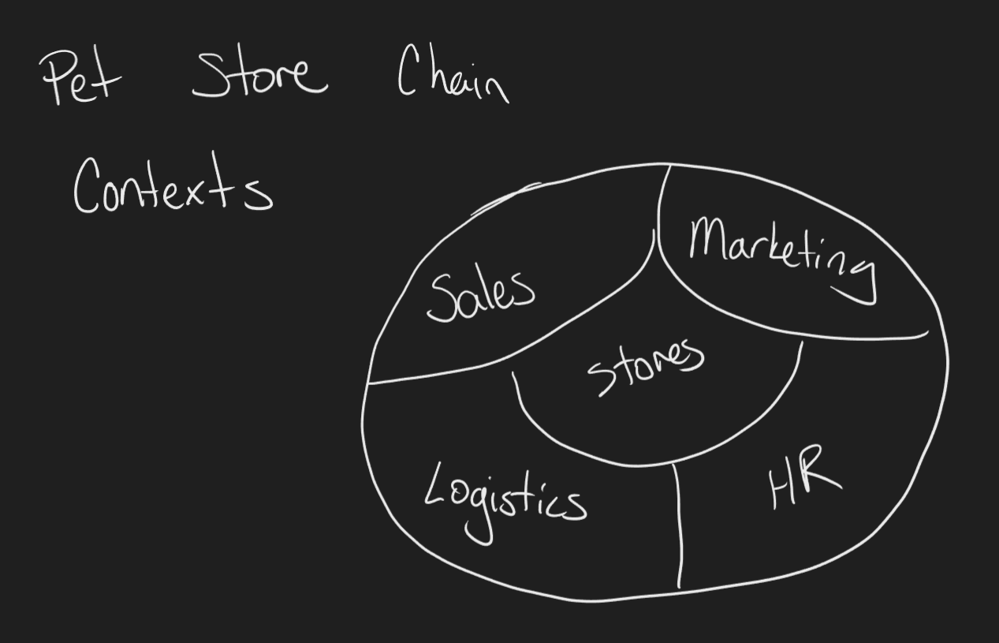
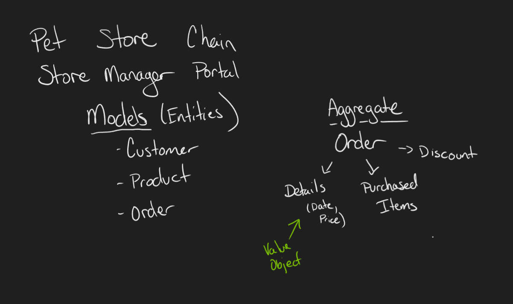

# Domain-Driven Design

Domain-driven design (DDD) is an approach to software development that emphasizes the business area's importance in software design. It involves creating a model that reflects the key concepts and relationships in the domain, using a shared language, and identifying boundaries between areas. DDD involves close collaboration between developers and domain experts to build a shared understanding. The goal is to create software that closely aligns with business, and that can be easily maintained and adapted over time.

## Benefits of Domain-Driven Design

- Improved Communication: DDD emphasizes using a ubiquitous language shared by all stakeholders, making it easier for everyone to understand the domain and communicate effectively.
- Better Alignment with Business Goals: DDD creates a domain model that reflects the business. This leads to software aligned with business goals, making it more effective and efficient.
- Easier Maintenance & Greater Flexibility: DDD creates a modular software system that is easier to maintain and modify over time. It allows developers to change specific system parts without affecting the rest.
- Improved Quality and Reduced Risk: Using a well-defined domain model and consistent language reduces the risk of misunderstandings and errors, leading to a higher-quality software system.

## Challenges of Domain-Driven Design

- Requires Cross-Functional Collaboration: DDD requires close collaboration between developers and domain experts. This can be challenging because it requires different groups to collaborate and share knowledge effectively.
- Can be Time-Consuming: It may require additional planning, design, and testing efforts to ensure that the model is accurate and the implementation is effective.
- May Require Changes to Development Processes: DDD may require changes to the development process, including new tools, techniques, and workflows.
- Not Suitable for All Projects: DDD may only be suitable for some projects. It works best for complex systems with well-defined domains and business rules. For simpler systems or projects where the domain is poorly understood, DDD may be overkill and not worth the additional effort.

## Concepts

### Ubiquitous Language

Ubiquitous language refers to a set of terms shared by all dev team members and domain experts. The idea is to create a shared vocabulary for all stakeholders to communicate and understand the software system. By creating a ubiquitous language, everyone involved in the development process can have a shared understanding of the domain and communicate effectively. It is developed in collaboration with the business, and the dev team is responsible for ensuring the terminology is consistent throughout the codebase.

### Bounded Contexts



A bounded context defines a clear boundary between different models and the language used within those models. This model can be seen as a distinct, self-contained subsystem within the larger application suite. For example, this could be the boundary between the sales and marketing departments.

Developers can use bounded contexts to separate different parts of the system and ensure that changes made to one region do not have unintended consequences in other parts of the system. This makes it easier to maintain and scale the system over time.

### Entities, Value Objects, and Aggregates

Entities, Value Objects, and Aggregates are fundamental building blocks in Domain-driven design (DDD) that help to define and model the domain.



- Entities are objects with unique identities, distinguished by their attributes and behavior. They have a long lifespan and are generally persisted over time. Examples of entities include customers, orders, and products.
- Value Objects are objects that do not have a unique identity and are distinguished only by their attributes. They are immutable and do not change over time. Examples of value objects include dates, times, and currency amounts.
- Aggregates are clusters of related objects that are treated as a single unit. They are used to enforce transactional consistency and to ensure that the domain rules are satisfied. The aggregate root is the single object within the aggregate responsible for maintaining the consistency of the aggregate. This might be a customer object along with their address and billing information.

### Domain Events

Domain events are significant occurrences or changes within the domain that capture the fact that something important has happened but contains no behavior or logic. For example, a customer placing an order might trigger a domain event that records the order information and updates the inventory.

Domain events help to decouple different parts of the system and improve the overall flexibility and scalability of the software. They allow changes made in one part of the system to be propagated to other components without creating direct dependencies. They can also be used to ensure that different parts of the system remain synchronized and that business rules are enforced.

### Repositories

Repositories are used to manage the persistence of domain objects. A repository is an abstraction that provides a way to store and retrieve objects in the domain model without exposing the underlying data storage mechanism to the rest of the system. They manage the lifecycle of domain objects, including creation, retrieval, modification, and deletion. They provide a way to abstract the domain model from the underlying data storage mechanism and also offer a way to enforce business rules and constraints.

```C#
public class OrderRepository
{
    private readonly IDbConnection _dbConnection;

    public OrderRepository(IDbConnection dbConnection)
    {
        _dbConnection = dbConnection;
    }

    public Order GetById(Guid id)
    {
        string query = "SELECT * FROM orders WHERE id = @Id";
        return _dbConnection.QuerySingleOrDefault<Order>(query, new { Id = id });
    }

    public void Save(Order order)
    {
        string insertQuery = "INSERT INTO orders (id, customer_id, order_date) VALUES (@Id, @CustomerId, @OrderDate)";
        string updateQuery = "UPDATE orders SET customer_id = @CustomerId, order_date = @OrderDate WHERE id = @Id";

        var existingOrder = GetById(order.Id);

        if (existingOrder == null)
        {
            _dbConnection.Execute(insertQuery, new { Id = order.Id, CustomerId = order.CustomerId, OrderDate = order.OrderDate });
        }
        else
        {
            _dbConnection.Execute(updateQuery, new { Id = order.Id, CustomerId = order.CustomerId, OrderDate = order.OrderDate });
        }
    }

    public void Delete(Guid id)
    {
        string query = "DELETE FROM orders WHERE id = @Id";
        _dbConnection.Execute(query, new { Id = id });
    }
}
```

## Implementing Domain-Driven Design

1. Identify the Domain: The first step is to identify the specific business domain or problem the software system intends to solve. This involves working with domain experts to understand the business processes, concepts, and rules essential to the organization and its stakeholders.
2. Refactor Legacy Code: In many cases, existing code may need to be refactored to better align with the DDD approach. If the legacy code doesn't have tests, it may be necessary to write those first to avoid breaking existing functionality.
3. Build and Test the Model: The domain model is the centerpiece of DDD. It is the representation of the domain that developers use to build the software system. The model is built through continuous collaboration and iteration between the domain experts and developers.
4. Integrate with Other Systems: The final step is to integrate the software system with the organization's other systems and tools.
