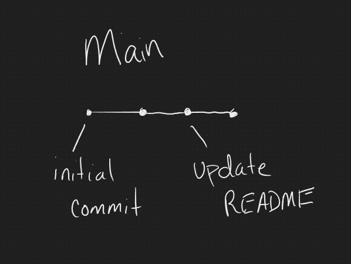
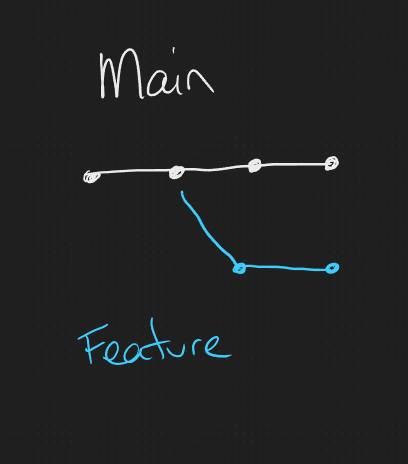
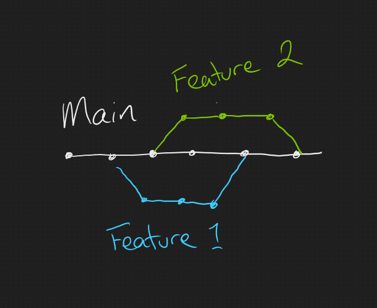
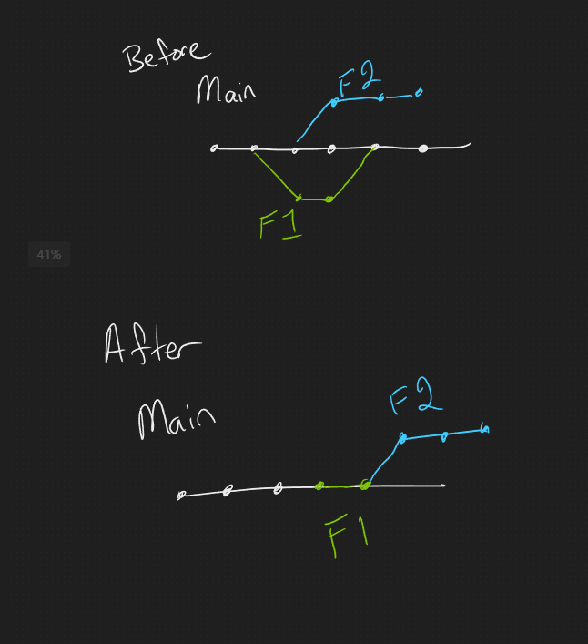

# Git Basics

- Source Control History
- What Does Git Do For Us
- Git Clients
- Getting Code - init, clone, pull, remote
- Basic Commands - add, commit, push
- Branching Strategies - branch, checkout, merge
- Advanced commands - stash, rebase, pull requests

Full list of commands: <http://git-scm.com/docs>

## A Short History of Version/Source Control

Definition: Source or Version control is a strategy for tracking different versions of files as they change.

Technically the first version control system was built in the 1960's but for normal use, we tend to go through a few phases.

Simplest Version: Once upon a time (and unfortunately this still happens). Changes were tracked manually, if at all. Devs would have to keep multiple copies of the software on their machine and any changes the made as a team would have to be manually integrated.

File Share: An upgrade to this system involves keeping the main versions of the software in a central location, but still tracking changes manually or not at all. This allows devs to have access to the same version of the work, and may have some tracking capabilities, but still makes it hard to integrate changes.

Modern Source Control: Modern systems have centralized storage, and also fully track every change that is made to the code. In addition, they allow things like blocking other devs from making changes to a specific file, merging different changes together, and easily moving back and forth between code versions. Git is probably the most popular, but others like mercurial and SVN still see a lot of use.

## Why Use Source Control?

There are two main reasons for using source control:

1. It creates a full history of all code changes and acts as a built-in backup system for code. If your computer fails, you can get another copy from source control instead of losing the data. You can also look at history, see what has changed, and revert to an earlier version if you want to undo something.
2. It smooths out the process of having multiple devs working on the same code. Even if you spread out the tasks to different developers, they occassionally will fall into scenarios where they need to make changes to the same files. Source control systems create strategies for handling those scenarios with a minimum of disruption to dev's work time.

## Git Clients

There are three ways to work with git on your machine. Each has it's advantages, and devs usually develop a preference for one of them.

1. Command line. This is the simplest way to interact with git, since it is what the base install comes with. It does take some time to memorize commands, but once you do it allows for the maximum amount of control as UI option often bundle multiple commands into a single step.
2. IDE integration. Visual Studio/VSC, Ecplipse, Jetbrains, etc. almost allways have integrations with source control built in. This is often the most convenient option since you can stay within the same software you are using to write the code.
3. Seperate GUI's. SourceTree, Git, and Github are probably the most common, but there are plenty out there. They tend to have more features than integrated UIs, so can be useful for difficult scenarios if you want to avoid command line.

I'll mostly be using command line to demo these things, as it's the simplest and most universal way to interact with git- no matter what client you are using, these are the commands being run.

### Git servers

Technically anyone can run a git server themselves, but most of us don't bother. As with many things, this is often outsourced to an external service. The most common choices are GitHub, GitLab, Bitbucket, and Azure Devops.

## Getting Code - init, clone, remote, fetch (pull)

### init

`git init` initializes a git repository and is almost always your first step when creating a new project. It creates a folder names '.git' that includes a whole bunch of files in it. For the most part we won't interact with these files directly, but basically this holds all the information about the repository and tracks every change made to the code over time. Basically this folder is where all the "magic" is.

### clone

`git clone <location>` copies all the code from a remote location. It's essentially a copy/paste command.

### remote

`git remote add <name> <location>` allows you to setup a place where you interact with your code remotely. Cloning gets the code but doesn't create a relationship between your code and that remote location. `remote` is something we can leverage multiple times to add our changes to the main repository and get changes from others.

### fetch

`git fetch` gets the latest changes from our remote. We often use a variant of this, `get pull` instead since that gets the changes and then automatically applies them to our copy.

## Basic Commands - add, commit, push

### add

`git add <file>` tells git you want to add the changes you've made to tracking, or "stage" them. `--all` or `.` adds all the changes you've made- just be sure you are setup to not include anything you didn't want like passwords!

### commit

`git commit -m "<commit message>"` tells git to take a snapshot of the current version of the code. Once we've created a commit we can return to that state at any point. You always include a message along with that to indicate what/why you've made those changes so other people know what is happenning.



### push

`git push` is the final step in making changes. It takes all the commits you've made on your machine and sends them back to your remote source. This allows other people to access those changes and update their own copies.

# Part 2 - Branches

## What Is a Branch?

Short answer is that a branch is a independant version of the code. The full set of them is called the "working tree". While git itself doesn't mandate different types of branches, we generally designate different types of branches. Common ones might be main, develop, feature, and hotfix branches.



## Branch Commands - branch, checkout, merge

### branch

`git branch <name>` simply splits off a new branch from your current one with that name. Not terribly complex, but it's important to know that this does not actually change to that branch, only create it.

### checkout

`git checkout <name>` is what actually changes your code to a different branch. The `-b` modifier is extremely useful since it makes the branch and swaps to it in one step since this is usually what you want to do when creating a branch.

### merge

Merge let's you apply changes from one branch to another. Once you get the basics down, merging, and it's partner rebase, will be a topic you want to dig in more. I'll just get you started here.

If you have checked out the desitination branch then it is simply `git merge <source branch>`. If you don't, then you can add the `--into-name <branch>` modifier.



#### Merge Conflicts

Git will do it's best to combine these changes, but it can't always figure out how to do so. This is usually because the branches have made changes to the same section of code. You can choose to back out of the change, but usually you have to deal with them.

Conflicts will show up in files [like this](https://git-scm.com/docs/git-merge) with your version on top and the incoming change on the bottom. If you open this in an IDE like Visual Studio code it will probably try to get you to resolve the conflict. Currently, the tools in your dev environment are a solid choice for going through and fixing these issues. Git allows you to edit the changes directly in command link, or you can use whatever stand-alone tool you prefer.

```
Here are lines that are either unchanged from the common
ancestor, or cleanly resolved because only one side changed,
or cleanly resolved because both sides changed the same way.
<<<<<<< yours:sample.txt
Conflict resolution is hard;
let's go shopping.
=======
Git makes conflict resolution easy.
>>>>>>> theirs:sample.txt
And here is another line that is cleanly resolved or unmodified.
```

## More Branch Commands - stash, rebase, pull requests

### stash

Sometimes you want to save your changes with git, but you aren't ready to commit them. Maybe you need to check something on another branch real quick or (gasp) you've accidentally started working directly on main. `git stash` lets you "stash" away those changes so that you can do whatever you need and then reapply them. If you need to be more organized, you can also name your stashes and apply them specifically by name.

### rebase

There is often a debate between devs whether merge or rebase is the best way to integrate remote changes into a feature branch. Usually the argument for rebase is that it removes extra merge commits, but it is also a bit trickier since it actually changes your branch history. It does also have the nice side effect of letting you get rid of all those commit messages that are just "why did I think this was a good idea at 3 AM ?!?!?!".

Git merge keeps the history as it was with seperate lists of changes for each branch, rebase pretends that you split your branch from the most recent version of the source.



### pull requests (merge requests)

A pull or merge request is basically a merge, but instead of doing it on your local machine you do it on the git server. It's also not applied immediately, it's just setting your intention to add the code and allows you to document the changes and why you want to make them. Other people on your team can then review the changes, comment, request additional changes and finally approve and apply the changes.

Most projects will use these as part of their branching strategy. You can merge all you want into your personal version, but if you want something added to the main branch you are required to do so via a PR. They may also have a specific format they want the PR in, so check those if you intend to open a PR on someone else's repo.

## Branching Strategies

### What is a Branching Strategy?

Branching strategies determine how a team organizes their work. There are a couple that are particularly popular, namely git-flow and GitHub flow. Since GitHub flow is simpler, we'll use that one today. It only uses two types of branches: Your main (master) branch and feature branches. For most projects this is enough to keep your code organized.

### GitHub Flow Steps

1. You `main` branch is always deployable, and the official recomendation is to deploy changes as soon as they are added.
2. Your feature branches should always have descriptive names.
3. Push your code to the server often.
4. Make PR requests whenever you want to update the `main` branch code, or, in some cases, want to discuss a change youd like to make.
5. Have someone other than the author review every PR before it is merged. Once it is merged, go ahead and deploy it.
