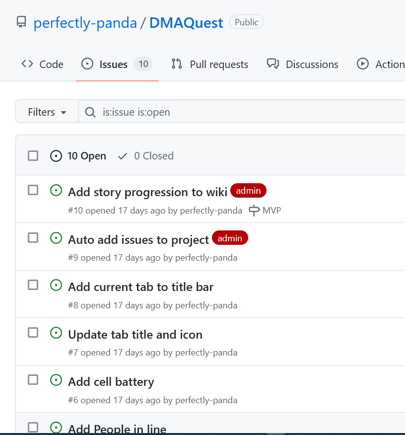
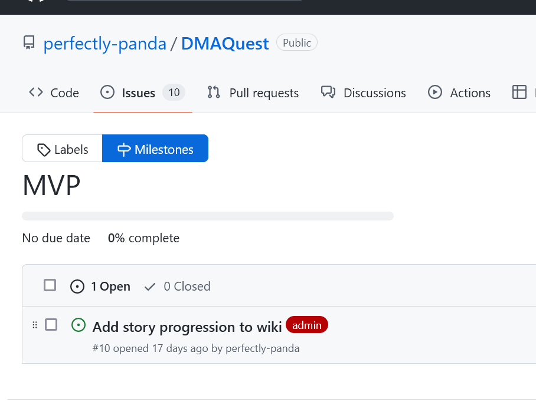
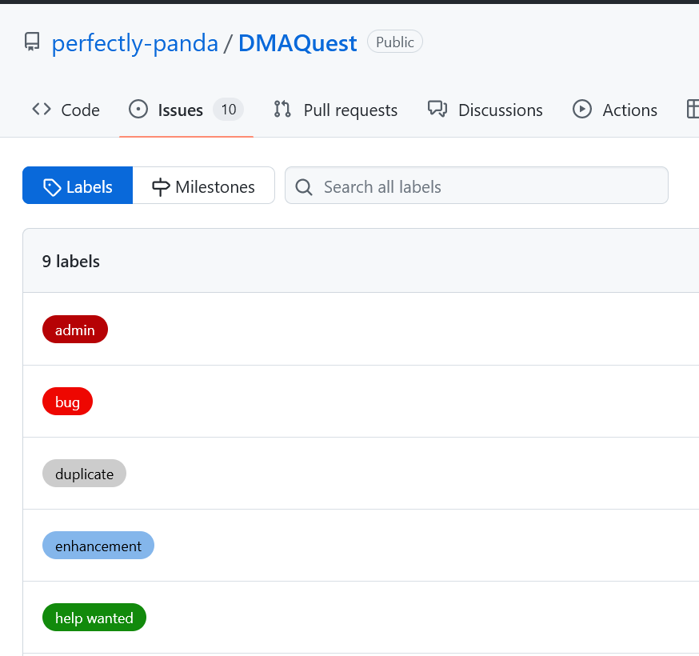

# Why Everyone Uses Agile

Some people use some form of agile, and some use "agile," where they say the word a lot but don't apply any of the processes. This workshop isn't meant to be a deep dive into Agile- that's a whole separate topic. Today is about taking just a couple of concepts commonly used in Agile and applying them to an actual project.

- Why GitHub?
- Building a backlog
- Managing Issues
- Organizing Issues with Projects
- Documentation

## Why Github for Project Management

In my opinion, there is plenty of space for improvement in Github's management tools, and hopefully, they will continue to improve. There are two main reasons I have for choosing GitHub for small projects:

It's often where the code lives, so it keeps everything together.
Very few features require a paid subscription on public repos. Private repos have more restrictions but still offer enough for small teams.

## Building a Backlog

One of the things I'm pulling from agile is the backlog- this is a place for everything you need or want to do. To keep that somewhat manageable, we usually apply a hierarchy to those items, from the big picture down to specific details. There are a lot of different terms, and people define the same word in different ways, but the standard ones I'm aware of break down this way.

- Epic: This is the highest level kept in the backlog. A single project can have multiple epics, but they are usually things that will take a month or more to complete. For example, a website might have an epic for its initial MVP (a minimum viable product, a beta, or even an alpha version).
- Features: Features are chunks of work from the epic that will take quite a while to complete. If my website MVP is my epic, one feature might be the admin interface.
- User Story: A user story is a specific piece of functionality. It's called that because it's usually framed as a user's action. The website admin interface could have a user story for admins to be able to update a user's information.
- Tasks: These are the specific things the dev needs to do to make the user story function and are usually something they can complete within a day. Create a UI for the user info, call the API, have an API endpoint, and store the information in the database.

GitHub currently offers two tiers of organization. The primary tool is issues, which I would roughly put at the user story level. You could make issues for each task, but that could cause more issues than you want to manage. Instead, I'd suggest using markdown checklists to create individual tasks for an issue.

The second tier is milestones, which could be used as features or epics. You can't nest a milestone inside a milestone, so to have multiple tiers of these, you'd need to get creative or use something like tags, which we'll get to in a bit. You can also nest issues inside of issues by linking them in a task list to group things.

## Managing Issues

Milestones are one way to manage your list of issues, but you can also tag them with labels. These help you group items together regardless of what milestone they are connected to. Starting out, there are things like "bug" or "admin," so you can do things like quickly finding out how many open bugs there are. Some are meant for other people to contribute to your code. Labels like "help wanted" and "good first issue" are used across many open-source projects to indicate where people can contribute.

If you are working with others, than assigning issues to people is extremely helpful, and linking issues to branches and code can help you keep everything in sync.

## Organizing Issues Into Projects

So far, everything has just been a list of issues, which is fine when you have a few, but it quickly becomes challenging to manage, especially if you want to see the status of each item. For that, we use projects and the magic of agile kanban boards.

Kanban roughly translates to "card you can see" and was first developed in the automotive industry. It uses columns and cards to track the progress of specific pieces of work. We'll sometimes still use post-it notes and a whiteboard, but digital versions are more common now.

Usually, you'll start with a couple of columns- to-do, in progress, and complete. Things like backlog and "needs review" are some additional options. As you work on a task, you move the card from left to right based on the task's current status. This allows anyone involved in the project to quickly see what is currently being worked on.

There are a couple of other options in the table view- adding additional fields to track various things is possible. If you are concerned about sprint planning, you can add a field here.

## Document Everything

The final thing I want to cover is documentation. The thing that every project needs and no one wants to do. There are a couple of good options here- wikis and GitHub pages. Wikis are more targeted at other people working on the project since they are limited in styles to plain markdown.

GitHub pages is a (usually) public, static site. While they are more work to set up, because you can build them from code, you have many more options. The main restriction on GitHub pages is that you can't use them to make money. For documentation sites (like these notes), they are a fantastic option.

