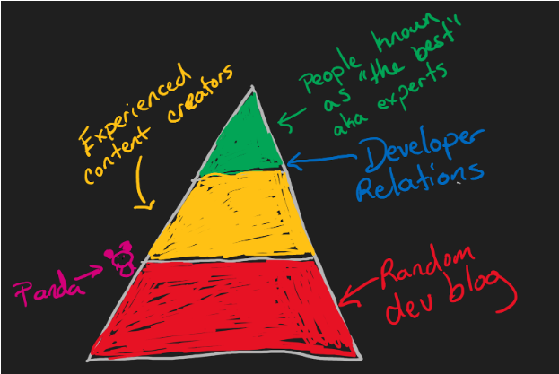

# Researching in Tech

(when your best resource is either a Reddit troll or an AI that regularly hallucinates info)

Two types of research are usually done in tech: general knowledge about a topic and trying to solve a specific problem.

There are also several types of resources that we use:

- Courses & Books
- Shorter videos, blog posts, and articles
- Occasionally there is relevant peer-reviewed research
- Product forums
- General forums (Stack Overflow)
- Communities on Slack or Discord
- Product documentation
- Souce code (if available)
- AI tools

## How do you check if a source is credible?

### "Peer Review"

Who are people referencing in their work?
"What resources do you recommend?"
Are there any awards given from AWS Heros, Microsoft MVPs, etc.
Did they directly work on the project?

### The Blog Content Pyramid

All those levels contain good and bad content- being an expert doesn't prevent someone from being wrong. However, the individual's reputation in their field can help determine whether they are likely correct.

### Look for Consensus

- When researching a topic, try to look at multiple sources.
  - Bonus points if they are independent (aka not referencing each other directly)
- What do these articles agree on? Where do they disagree?
- Finding a contrary opinion might be worth trying if everyone agrees. Even if you disagree with them, there's a good chance they will bring up some good points.
- If applicable, check the up/down votes and comments. Even if a Stack Overflow answer looks excellent, many comments disagreeing with the answer are a red flag.

## Validate AI Content

AI tools built on GPT are getting super popular, but they are less reliable for factual information than they first seem. ChatGPT makes up information if it doesn't know, and both ChatGPT and Copilot will often suggest code that needs to be updated or is full of security holes. ChatGPT is also working on older data, so it can't have the latest info for code.

- When using ChatGPT, you can ask for specific references instead of separately Googling the question to verify.
  - Always use Google (or a similar search engine) as a backup if you need more clarification.
  - Bing's new chat feature is also GPT-based. It doesn't count as a non-AI source. :)
- Treat AI code as a first draft. A huge part of being efficient with Copilot comes from editing its suggestions rather than trying to get code that is 100% correct.
- Resist the temptation to push code written by AI without careful review. As they improve, it is tempting to decide it is "good enough" and push. Remember, these AIs create responses by writing code that looks right rather than by understanding how code works or judging the quality of a solution.

## Gaining Foundational Knowledge

- Creating a basic level of knowledge in a subject will allow you to judge content, including information from AI tools.
  - I would avoid using AI tools like ChatGPT to build this foundation.
- Use the "blog content pyramid" to find experts to follow.
- Learn to skim content. Use this to go through expert content quickly. It gives you enough of an idea to find the details when you need them.
- Only some things you read need to make sense immediately. Even if the specifics of a piece don't make sense, you can pick up some terminology and look at how the person approaches the problem they are discussing.
- Create a content feed (I use Feedly) and check it regularly. You don't need to read every article.

## Solving a Specific Problem

- Ask an AI. While it may not be a useful answer, it is a good starting place.
- Master the art of Google-fu. Double quotes and plus/minus signs can be the difference between your answer on page one and page ten.
- Time to make use of that foundation! Have you skimmed any content about the subject? If so, you can find it again. Some devs will even create an archive of what they've read to find things again more quickly.
- Focus on the situation first, not the solution. A great solution is only helpful if it reflects your issue. A poorly written solution may not solve your problem, but it may get you going in the right direction.
- Double-check comments (if available). Even if the initial post doesn't match your situation, someone in the comments may have pointed out something similar to yours.
