# Intro to Power BI

Dataset: [Stack Overflow Developer Survey 2022](https://insights.stackoverflow.com/survey/)

## What is Power BI?

Power BI is a popular enterprise business intelligence tool. It allows you to gather data and transform it into charts, tables, and other visualizations. It shares engines with Excel PowerPivot and Microsoft Analysis Services.

There are three big-picture components to the Power BI ecosystem: Power BI Desktop, the Power BI service within M365, and Power BI Report Server (which is a rebrand of SQL Server Reporting Services). Since the service has minimal development capabilities, we will focus on the desktop version.

**Note: The desktop app will suggest you sign in to the Power BI service. This isn't required for this workshop.**

## Importing Data

When you first open up the app, there are a lot of menus and toolbars. For now, we can ignore all of them except one- at the top left is the "Get data" option. The Stack Overflow data is in CSV format, so select that from either the 'Common Data Sources' or the 'Get Data' modal. Find the 'survey_results_public.csv' file you downloaded and open it. Power BI will give you a preview of what it thinks the data should look like once loaded. It should be correct, and we can choose 'Load.' It may take a few seconds to load in, but you should be back to the blank report view with the table listed in the far-right 'Fields' sidebar.

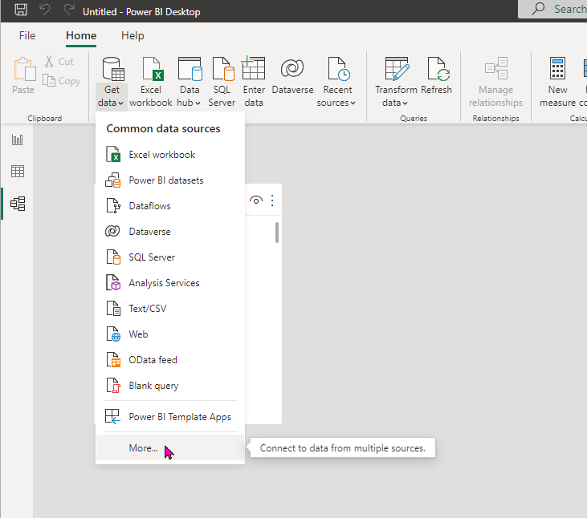

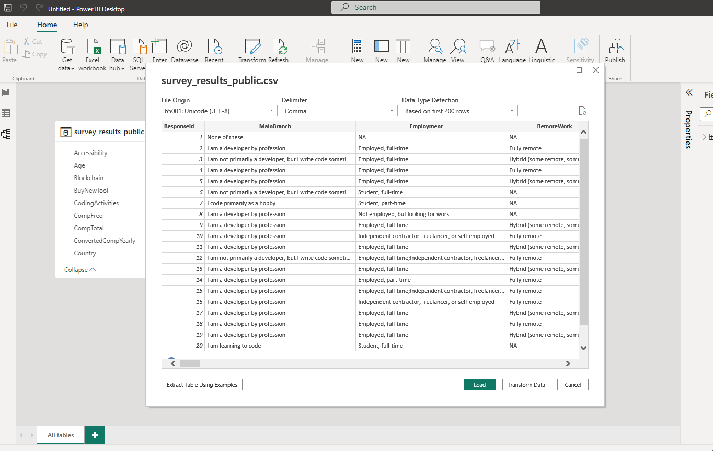

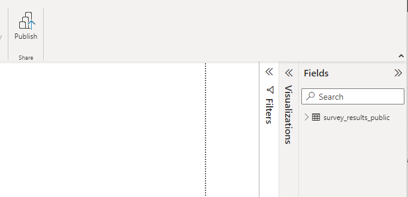

## Navigating the Data

Before making the pretty pictures, let's look at how data Power BI reports handle data. There are three options on the left side navigation. The default is report view, which is (shockingly /s) where the resulting report is.

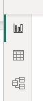

If you don't care about how the database works, skip the next little bit.

### The Nerd Stuff

Power BI stores data in analysis services (you can even see it running if you look at Task Manager). It is an in-memory column store database. I'll let you look up column store if you want to know more about that. The critical aspects are that the data storage is compact and it is incredibly efficient at running the calculations commonly used in reports.

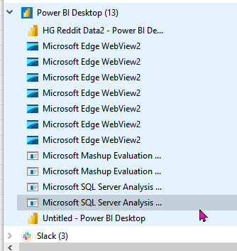

To be able to pull data from so many different types of data sources, it uses a language known as Power Query (or M). It won't be covered here, but you can look at the code Power BI generated for the CSV file by selecting 'Transform Data' in the top ribbon.

### Table View

Table view lets you look at the tables like you would a spreadsheet. The main difference is that you can't edit the data here. Instead, it's used for reviewing the data and changing various settings at the column level.

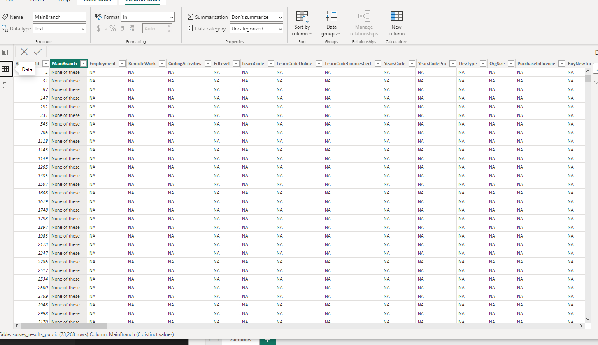

### Model View

The model view is where you can see all the tables in your data model and how they relate. Because there is only one table in the sample data, there is little here. In real-world reports, you usually have anywhere from a handful of tables to several hundred.

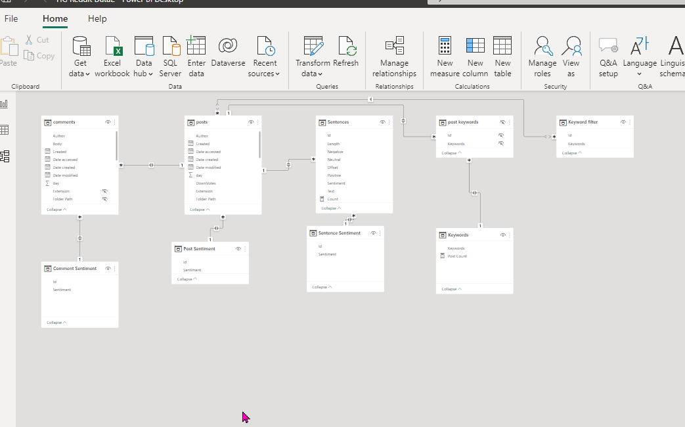

## Report View

In the report view, the essential tools are along the right side: Filters, Visualizations, and Fields. Visualizations are the different ways to display data, and the Fields lists out all the tables, columns, and measures. We have yet to get to measures, so don't worry if you don't know what that is.

## Your First Visual

Click and drag the age column into the report view to get started. You'll get a table visual with the selected data. This table already illustrates an important concept in Power BI. It functions primarily with unique values, so there are only ten rows in the table, even though there are 70,000 in the dataset.

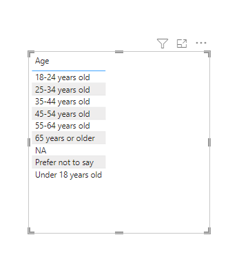

The visualizations bar will also show information about whichever visual we selected. To add a column, scroll down to 'YearsCode' and drag that to either the column list in the visual bar or onto the table itself. There is still only one row per unique value, but it's unique based on both columns.

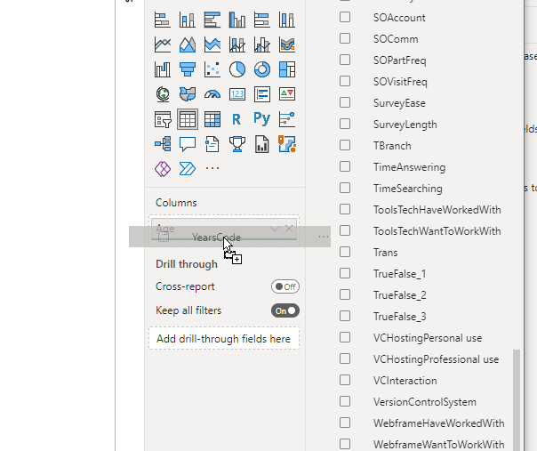

For now, delete the 'YearsCode' column from the table by clicking the X on the visualization bar.

### Adding Context

There are a couple of things we probably want to do with this data. The first is to eliminate any values marked as 'NA' (Not Applicable) or 'Prefer not to say.' Next is to give helpful information about the data- how many devs were in each category.

#### Add a Filter

To filter values without editing the underlying data, one option is filters. With the age visual selected, there are three levels of filters available: visual, page, and report. Since there is a visual selected it will automatically add a filter for any data in that visual, but the filter is set to 'All'. Open the age filter to change it.

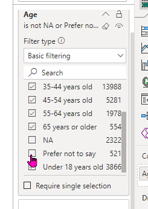

We want all the data except a couple of values, so we first choose 'Select all' then scroll down and remove the checks next to 'NA' and 'Prefer not to say.' The table should update to hide those values.

#### Add a Measure

Measures let us combine multiple rows of data into one. This is how things like sums and averages are added to the model. Simple measures like sums can be done within a visual, but adding them to the model keeps calculations consistent and allows you to build other measures with them.

Power BI uses a language called [DAX (Data Analysis Expressions)](https://learn.microsoft.com/en-us/dax/) within reports. If you have any experience with writing formulas in spreadsheets, then you should be able to apply that knowledge to DAX as they look very similar.

There are two big differences between working with a spreadsheet and working in DAX, and they will probably twist your brain a little bit.

1. Spreadsheet formulas act on specific cells within a spreadsheet, whereas DAX works on columns and tables. In DAX you select the specific cells within a column by using filters.
2. DAX doesn't assume any specific order for the data rows. If I have one row for each month and want to calculate the change from the previous month, I have to point at the previous month using filters since DAX doesn't assume that the previous month is also the previous row.

Fortunately, the DAX for counting how many devs are in each age category is not too complex. Right-click the table in the Fields bar and select 'New measure.' At the top of the report, a formula bar will appear. To the left of the equals sign is the measure's name, which will show in the field list and on visuals. The right side is where the formula goes.

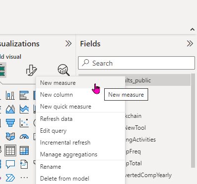

Measures must always resolve to a single value, no matter how many rows are included in the result. Since each row in the table represents one developer who took the survey, `COUNTROWS()` will give us the count. The table name goes inside the function parameters inside single quotes. After hitting enter, the measure will show up in the fields list with a calculator next to the name, so we know it is a measure and not a column. The final formula will be `Dev Count = COUNTROWS('survey_results_public')`.

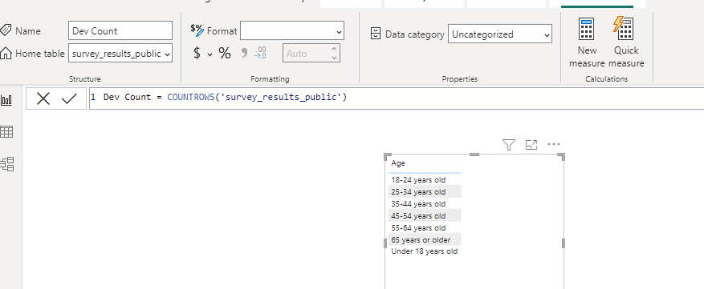

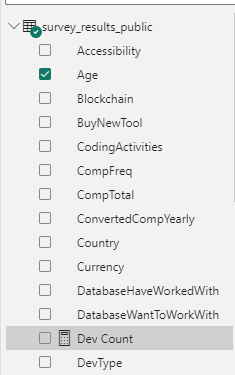

#### Use the Measure

To see how this works, drag the new Dev Count measure into the table. The counts for each value will show up in the table along with a total. The way this works without rows or cells is that each value in the Age column acts as a filter, and the `ROWCOUNT()` function is applied in the context of that filter. For the total value, there aren't any age values in the table applied, but it still respects the visual filter we added-- 'NA' and 'I prefer not to say' rows aren't included.

## Visualizing the Data

Tables are useful, but the goal is to visualize data- to allow humans to interpret it more quickly than by reading. With the table selected, switch it to a stacked column chart (top row, second from the left). Power BI will automatically guess that we want the columns to be the age groups.

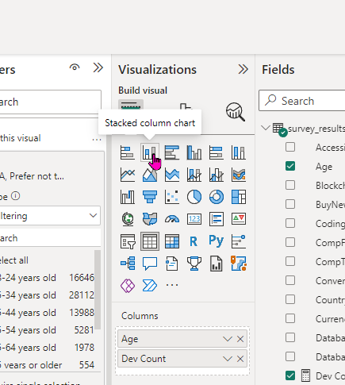

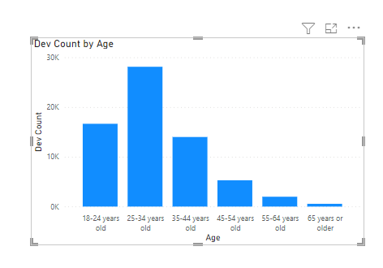

The results are sorted by count, and we probably want them sorted by age (You may want to remove the 'Under 18' values for this. It can be fixed, but it is outside of the scope of this workshop). Each visual will have a few options at the top or bottom right. Ordering is under the three dots. You can change it to sort by age ascending to get the graph looking the way most would expect.

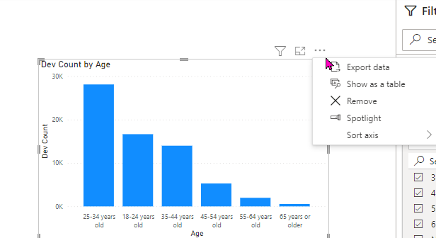

### Add Another Visual

The next thing we'll add is a map of where the devs are located. This might be disabled for you. If so, you can go into security settings and allow them.

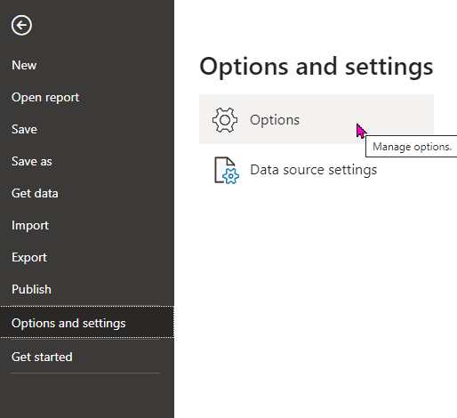

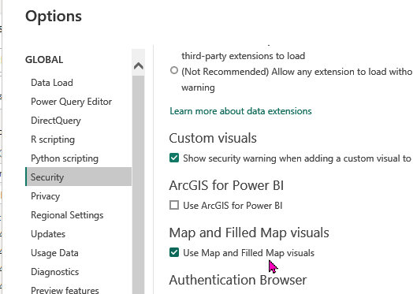

Once maps are enabled, click outside the bar chart so you don't have that visual selected. Click on the Map visual to add it to the report (Note: There is a plan map visual, NOT the ArcGIS Maps one). Once the visual is created, add Country as the location and Dev Count for the bubble size. If you want a more colorful map, add Country to the legend.

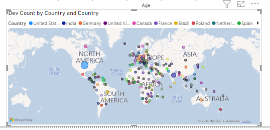

While cool, the bubbles are small, and they would look better if they were larger. To do that, open up the Format tab of the visualizations bar. If you added countries to the legend option, you may want to turn the actual text off, and I found 12 px to be a good size for the bubbles.

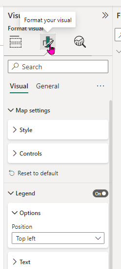

#### Interactions Between Visuals

Now that there are a couple of things on the page, the data becomes more interactive. Pick a country on the map and click its bubble. The age graph will automatically filter down to responses from that country. Click on the map outside any of the bubbles to remove the filter.

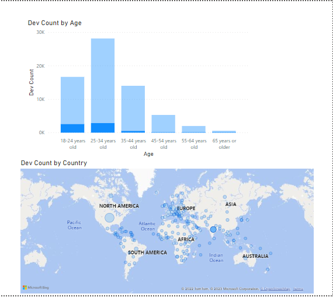

For countries with a lot of devs, like the US and India the default interaction is fine, but it doesn't work well for other countries. With the map visual selected, go to the format ribbon and click on 'Edit interactions.' Each other visual on the page will have three options in the same location as the sort menu we used before: filter, highlight, and ignore. Swap the bar chart to the first option (filter) and turn off edit interactions. Now when you click on a country the bar chart will only show values for that country.

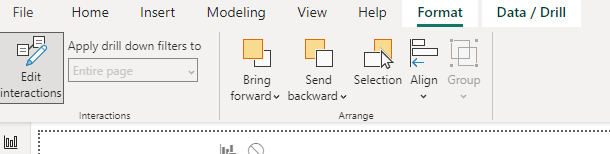

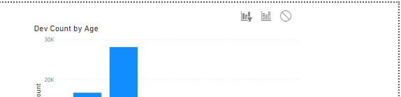

### Slicers

Filters are one way to filter the data, but they aren't great UX on a finished report. If there is a way you expect users to filter data on their own,  you can use a slicer visual. Unselect all the existing visuals and add a slicer visual- it looks like a to-do list with the filter symbol about two-thirds down. Add the OrdSize column to allow users to filter the visuals by that column easily.

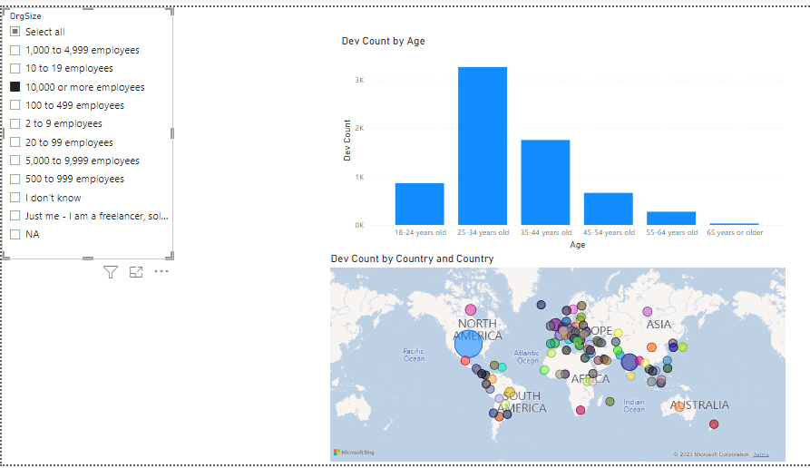

## Wrapping Up

There is much more to explore, but you should have a good start! When first learning, you can gain a lot by pulling in some data that interests you and trying to figure out what insights you can gain from it.

Here are some ideas to get started:

- What size of a company will most likely allow me to work remotely at my current experience level?
- What level of education has the best annual compensation?
- (challenging) How many devs work with AWS, GCP, or Azure? (Hint, you can split `PlatformHaveWorkedWith` column into individual options, but you don't have to).
- (challenging) Split one or more of the multiresponse columns in Power Query
- (extra hard) Split the multiresponse columns into separate tables
