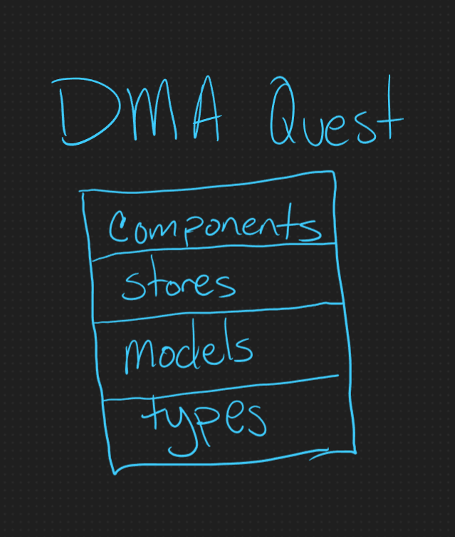
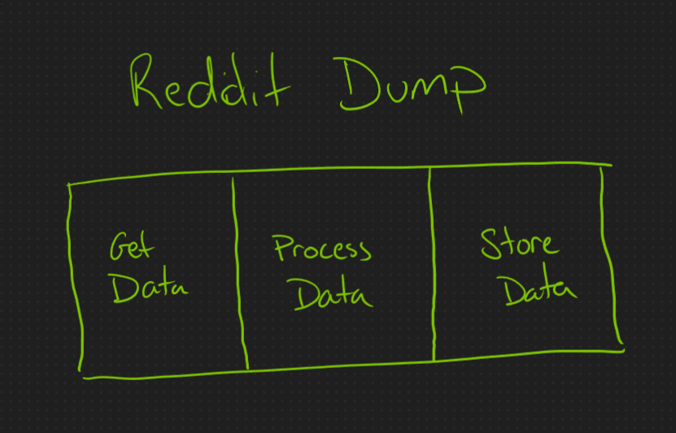
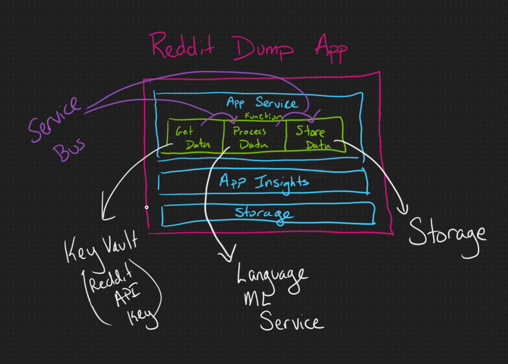

# Software Design Patterns: Monoliths and Microservices

For a while, it seemed like monoliths were dead and microservices would be the "only way" to build software moving forward, but now many devs are moving back to recommending monoliths. What the heck do those terms even mean? Which one should I pick for my next project?

## Definitions

With this sort of thing, it's always best to define our terms.

Monolith: The "old way" of doing things. When you think about creating an application, you usually default to this. All of your code lives in a single application that you deploy together.

Microservice: The "new way," though Wikipedia cites the first discussion around it back in 2004. (<https://en.wikipedia.org/wiki/Microservices>) The application is broken apart into individual services that each serve a specific function.

## Structure

These patterns can take many different structures within the microservice or monolith umbrella, but for the sake of examples, I'll go over a couple of my more recent projects.

### Monolith - DMA Quest

<https://github.com/perfectly-panda/DMAQuest>
<https://perfectly-panda.github.io/DMAQuest/>

DMA Quest is a small incremental game and a work in progress. However, there's enough there as of writing this to discuss design. All the website code is contained within the `src` folder. Within that, the folder structure is based on the function the contained code serves. For example, the `components` folder contains all the various chunks of HTML and JavaScript that make up the user interface. The `stores` folder contains all the data storage information- how it is organized in memory, edited, and accessed.

Monolith architecture often looks a lot like layers in a cake. Each piece is built on top of the lower layers, and the application spans all areas of concern.

### Microservices - Reddit Dump

<https://github.com/perfectly-panda/RedditDump/tree/main/ManageData>

This was originally a weekend project that pulls data from the HG subreddit and dumps it into an Azure storage account. Absolutely over-engineered, but it was a practice project, not something I'd do in real life.

There are a few different versions in the repo, but we are concerned with the code in the `ManageData` folder. Each component is treated like its own application within the Azure Functions service. The decorator `[FunctionName("Name")]` denotes a separate piece in the Functions service. There are 10 different microservices handling this one process.

Microservice architecture often looks like a series of vertical layers, with each section playing its role. Depending on the complexity, a service may act like a mini-monolith, with multiple horizontal layers for different parts of the process.

## Choosing Your Architecture

While you could use a hybrid approach, you should start with one of these patterns as your foundation. If you want a TLDR version, use monoliths unless you have an excellent reason to go with microservices for reasons we are about to discuss.

### Monoliths - Pros and Cons

#### Why Monoliths Are Great

The primary reason to build a monolith is that it is much easier to make, even at a fairly large scale. All the code is in one place, and it's easier to see how information travels from one code section to another. Deployment is also a lot simpler since you only have to worry about a single deployment pipeline.

They can also be much more stable since they don't constantly have to communicate with other portions of the code over the internet. You still need to be able to handle errors when they pop up, but you don't have to constantly account for retries and failures when different services are talking to one another.

#### Why Monoliths Suck

The first issue a company is likely to run into with a monolith app is trying to scale it. Some pieces of the application will require more resources than others. This can slow down the entire app, as that section hogs CPU and memory. Since there is a limit on how big you can make a server, you eventually start scaling horizontally- multiple instances of the same application running in parallel. Each copy contains the entire application in a monolith, even though it might be only a small part that needs additional instances. This leads to needing more hardware than you actually need.

The second reason you may want something other than a monolith is that you have a lot of devs working on the same application, especially when they are on separate teams. While tools like Git help developers collaborate on code, it still requires communication when different devs are working on the same section of the codebase. The more people you add, the more collisions will occur and the harder it is to keep that communication going.

### Microservices - Pros and Cons

#### Why Microservices are Great

The main reason to use microservices is to solve the cons of monoliths. Because each piece is a separate application, you can run extra copies of the expensive process without having the overhead of deploying the entire app each time. In addition, breaking things up into separate applications means that the codebase can better reflect a large company's structure. Each team is responsible for its own application(s) and won't have to worry about direct interference from a member of another team changing their code without letting them know.

There are also a couple of other considerations. While the number of times data has to move across the network dramatically increases the number of potential failures, it's also become a common practice to create checkpoints in critical paths. You save the data in an interim state before passing it on to the following link in the chain, so if there's a failure, you can start from where you left off instead of completely starting over.

The final piece is closely related to the scalability issue. Large cloud service providers like AWS and Azure offer services that are specifically designed to work with a microservice pattern (Primarily Functions on Azure and Lamda on AWS). These services are often the most cost-effective way to host your application.

#### Why Microservices Suck

Holy diagrams, Batman! Microservice architecture gets really complicated, really fast. One of its strengths may be that each service is much easier to understand, but putting the pieces together becomes much more challenging to understand than with a monolith. A monolith might have 3-4 layers you need to trace through. Each of the 100 different services in a microservice architecture may have its own version of those 3-4 layers inside. This is often complicated because hosts like AWS and Azure have their own web of products that all work together to host your application. The Reddit Dump application has 10 services, but 7 Azure products are involved in running it.

The other big problem with microservices I've already mentioned a couple times- the services all communicate with each other over networks. This isn't a reliable communication method, so you must be very careful throughout the codebase to account for this. In addition, it slows down the whole app as you wait for a request to work its way through all these different services.

## Wrapping Up

In the end, there's a reason why microservices became popular. They can be highly effective, especially when you are the size of somewhere like Google. The smaller your application, the less effective they become, and the apps most of us work on every day don't need this level of separation of concerns. However, the rest of the industry tends to emulate what big companies do, and it looked like the monolith was dead for a while. Fortunately, we've since corrected this over-application, and architects can choose the version that best suits their situation.
