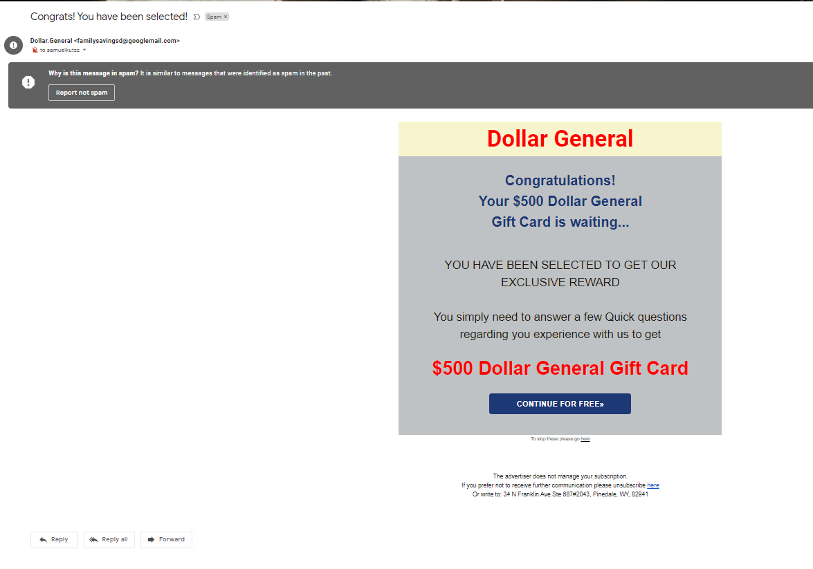

# Digital Privacy and Security

## Digital Privacy

When we talk about digital privacy, we aren't necessarily talking about not sharing personal info online, though that is part of it. Digital privacy is primarily concerned with having control over your data.

The good news is that laws are finally starting to catch up in this area, making it easier to control who gets your data online. The bad news is that the current state of digital privacy is terrible.

If you've heard of GDPR, it was one of the first significant privacy laws. One of the things that companies must do under GDPR is to allow you to request all the data that a company has about you. A good exercise is to ask for your data from Google, Apple, or Amazon (basically a big company you use) and look through everything they have. For example, I use Android and Google Home. Google will store all the locations I've been to and all the audio I say to my Google Home.

Another challenge with privacy is that most sites share your data with 3rd parties that you may not even be aware of. Many data breaches don't come from the company you gave your data to but some other company they've contracted with. I've been one of those 3rd parties for almost my entire dev career- my access to millions of people's data was not something that any of these people directly consented to.

Finally, I want to bring up the fact that while laws are changing, not all companies are complying with these laws. Sometimes, this is because managers don't have the tech-savvy to realize what is happening. Still, many companies believe that compliance is not worth the cost. Because of 3rd party sharing, you will probably run into this issue even if you are careful about which sites you use.

## Security

Privacy is about controlling the data we give to the world voluntarily. Security is about managing the information we don't want to share.

The basic principle of online security is that there is no such thing as a perfect system. Even if we could create software and hardware with zero vulnerabilities, there are still humans involved in the system, and humans are susceptible to social engineering. Things like the Discord hacks that go around use social engineering to get around all the security that Discord puts in place- why try to break into a house when you just hand them the keys.

The other main issue with security is that there are also humans involved in building the security systems for the websites and software we use all day, every day, and sometimes they screw up. Whether it's an honest oversite, a lack of knowledge, or simple naivety, mistakes happen every day. To understand the scale of that issue, in 2020, the [North Carolina Department of Justice](https://ncdoj.gov/wp-content/uploads/2021/01/2020-NCDOJ-Data-Breach-Report.pdf) received over 1600 reports of data breaches.

Fortunately, we don't need perfect security- we need protection that is good enough to deter those that want to do harm. Why go after someone with 2-factor authentication enabled (more on that later) when you could instead go for someone whose password is 'password.' This doesn't solve the problem of a website or app stealing our data, but there are also some options for minimizing that risk.

[Have I Been Pwned](https://haveibeenpwned.com/) keeps a database of hacked data and allows you to search by email, phone number, and even check passwords to see if the data is readily available.

## Protecting Our Data

Now that we've talked a bit about what the current state of technology is let's talk about minimizing those risks. I'll also touch on how to start taking additional steps, but I won't dig into this too deeply.

### Fake Data

There are plenty of times when we can innocently give out info that could be used against us. An excellent example is entering your birthday to "prove" that you are over 18 (because no one lies on those things). Not every site will store this data, but some might. If the goal is to check if I'm 18, then there really is no reason to give them my actual birthday, as this could be used to obtain even more info about me.

In most cases, you don't have to give a site your real name, birthday, or any other identifying info to make a site function, so don't give it and risk it being leaked. If you use a different name for each site, for example, it can also give you hints on who leaked/sold your data when you start getting spam emails with that name on it.

### Setting Privacy Options

Going on each site and setting your privacy settings is a pain, but it is worth it for big sites like Google or Facebook that have massive amounts of data on you. Just keep in mind that this data can genuinely make your life easier, an example being YouTube recommendations, so you may choose to allow some tracking- it's 100% up to you.

You can also get browser extensions to help block cookies, but it's important to note that this can break some websites.

### Passwords

There are three ways to ensure that your passwords are strong. Fortunately, passwords are the least likely to get exposed in data breaches. Standard techniques like [salting and hashing](https://www.vaadata.com/blog/how-to-securely-store-passwords-in-database/) make it almost impossible to get your data from a user table.

#### Complexity

The common wisdom is to use a complex password with lots of numbers and symbols, which isn't entirely untrue. The main thing that password complexity protects is what is known as "brute force" attacks, when an attacker tries as many passwords as they can until they get locked out.

By adding symbols and numbers, we can quickly increase the number of possible passwords. While they could get lucky, it's pretty unlikely with a longer password. The main issue with passwords like '2&Ir7FRjGi28' is they are almost impossible to remember, even if they are complex. The best choice for a complex password is one that is longer but easier to remember. Something like 'Sp00pyCheezit$' still uses numbers and symbols, is easy to remember, and is even longer than the randomized option. (And no, that's not one of my actual passwords.)

You also want to avoid passwords that include any personal information. Passwords like 'Rikku1$ACutePupper' are weaker because they contain my dog's name. That info is available on social media, so attackers will often use those sorts of terms to narrow down choices in a brute force attack.

If you need inspiration, 1Password offers a generator that can create easy-to-remember passwords: [https://1password.com/password-generator/](https://1password.com/password-generator/)

#### Password Reuse

Even though there are standards in the industry for preventing passwords from being lost in a data breach, not everyone uses them, so reusing passwords is also a big problem. The problem is that there are so many sites that we log into every day that it would be impossible to use and remember unique passwords for every one of them.

The primary tool for preventing password reuse is password managers. It might seem strange to hand all your passwords over to a third party, but even security experts recommend doing this as it is the only way to use unique passwords for every site. The main difference between password managers and other tools is that these companies are 100% focused on ensuring that data doesn't get breached. They store data in the most secure formats available and ensure that your data is inaccessible even to employees.

Popular tools include LastPass and 1Password. We'll talk about open source later, but an option that uses open source code is BitWarden.

You don't want to store your password manager's master password in the password manager, so you must remember that one. I also keep a few other critical passwords, like the ones to my phone and email, only in my head.

#### OAuth

Finally, many sites offer multiple OAuth providers instead of creating an account directly with them. This happens when you see "Login with your Google account." There are two reasons this is useful.

It eliminates a place where a password could get leaked. This can also be prevented by avoiding password reuse, but this is simpler.
Usually, the companies that offer OAuth services are large companies with massive security teams. This means they have the best and most up-to-date security to protect account access. While dev teams usually use tools that fall into the "good enough security" category, it's simply not possible for the average developer to stay on top of security issues as an expert in that area does.

#### Password Changes

We were told that we should change our passwords regularly, but that advice has been retired in favor of simply using strong passwords and 2-factor authentication, which we'll talk about next. Instead, you only need to change passwords when you've forgotten them or if you think there's any chance of a security breach.

#### 2-Factor Authentication

Let's say an attacker gets lucky and guesses your password. Now what? This is where 2-factor authentication comes in. It's named that because it means that the software is using two different methods to authenticate you. The second method is much harder to crack than a password, making your account much more secure. You've almost certainly used 2-factor. This happens when your bank asks you to confirm who you are using a text or email code.

There are several methods used for 2-factor that have varying levels of security.

- Email is the simplest and cheapest to implement. It's good enough for most sites, but since email data is rarely fully encrypted end-to-end (all the way from the sender to you), it is possible to intercept two-factor codes sent this way.
- SMS/Text Messages are significantly harder to intercept and have the advantage that most people have their phones near them at all times. While it is still possible to intercept an SMS, it's hard enough that this is the method that companies like banks usually use.
- Two-Factor apps take things to another level since the site isn't sending you any data that can be intercepted. Instead, you set up a link between the two-factor app and the site you are logging into, and they use that link to authenticate the codes you send. Each code is only useable for a limited time, so it can't be stolen. Some large companies (Steam and Microsoft, for example) have their own two-factor apps, but most use a standard maintained by Google. While you can use the Google two-factor app, another one called [Authy](https://authy.com/) is significantly better. It allows you to use multiple platforms so that you aren't locked out if you don't have your phone.
- Physical two-factor devices are the best authentication we currently have available. These require a second device to authenticate you, separate from your phone. Very few sites offer this level of security, but you can use them to protect your password manager. The most popular commercially available, [Yubikey](https://www.yubico.com/), also provides a 2-factor alternative to Authy, so you can essentially "convert" your physical two-factor to the digital one that is widely available. They are a bit of a pain to use and cost money. It varies by model, but my Yubikey cost me 50 USD.

### Avoiding Phishing

Phishing is using social engineering to get you to give an attacker things like your login information. Two-factor also helps with this since it requires an extra step, but you still want to avoid it if possible.

The primary way to avoid phishing is to be skeptical of anyone asking for your login info. They can look authentic, but there are a few things to look for.

Here's an email out of my spam folder:

- The fact that I'm not the "to" address is suspicious but isn't enough alone. This could happen with a legitimate promotion.
- The "from" address is a huge giveaway. Occasionally a hacker will get an opportunity to send emails from a company's actual domain, but usually, they will use something that looks close.
- The company's logo is not present in the email.
- There are two unsubscribe links. Similar to the to field, this could be legit but is a red flag.
- If I right-click and copy the URLs in the email, they go to a site called "storage. googleapis .com," which is not a legitimate site.
- The address at the bottom goes to a FedEx shipping box, not the business.

It's important to note that not all phishing attempts will be easy to spot- the good ones will appear to be 100% legitimate. Things like verifying the login URL or just going to the site directly instead of clicking the link can help avoid these scams.

When on the phone, never give your password to an "employee." If they are an actual employee, they should already have access to all of the info they need. They don't need to log in to your account for that. Some companies like T-Mobile will have you set a pin for talking to customer service, but this is separate from your account password.

### VPNs

VPN services usually get advertised as "watch Netflix from another country," but their primary use is security. Your internet provider can watch your traffic, and public wifi networks are a security nightmare. Just like two-factor adds an extra layer purely focused on increasing security, VPNs add an extra layer to all your internet traffic.

I don't have a specific service to recommend here, but PCMag has a pretty good list of options: [https://www.pcmag.com/picks/the-best-vpn-services](https://www.pcmag.com/picks/the-best-vpn-services)

The two main things for evaluating whether a VPN will protect your privacy are to look at their history and read up on their privacy policies. Some companies have a history of data leaks or allow some of your data to be viewed by employees.

### Open Source Tools

If you want to dig deeper into protecting yourself online, reading up on open source tools is the best place to start. These are tools where the code behind them is free and available to anyone.

1. This increases transparency. You can avoid giving data to a big company by using tools that are entirely independent of them. However, some are essentially controlled by a large tech company. Research and choose something to your own level of comfort.
2. Because the code is available to everyone, people interested in security and privacy can look through the code and verify that it does what it says it does.
3. Security and privacy rarely sell products, so companies don't have much incentive to create them. However, people who are interested in these areas will develop open source tools that are focused on them and don't have any interest in making money off them.
