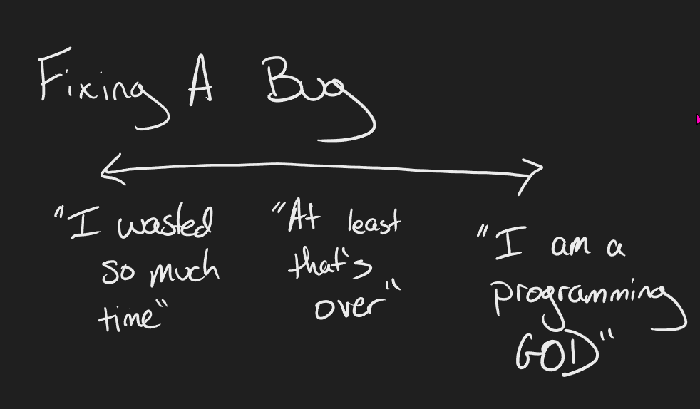

# Leveraging EQ in Programming

The few times we talk about EQ (Emotional Intelligence) in the tech world, it's usually about how we relate to others. That is extremely important, but when I looked at what I wanted to cover about debugging, I realized that part of what I wanted to cover more than anything is the human part of the process. This is the first of two workshops about that, with the next one on mindset.

## Coding Isn't Just Algorithms

### Why Coding is an Emotional Process

When we talk about coding, we generally focus on the part that ends up in the computer- the algorithms that make up our program. But code isn't just that. It's us trying to communicate our thoughts and ideas to a machine. As with all human communication, it will be affected by our emotions, whether we like it or not. This is true even in a product like GitHub's CoPilot, which is code generated by AI. While the final output is created by a machine, that machine was trained using human-written code, with all our communication nuance within.

The process of having to debug code is one space where this can stand out. Having to debug code is a manifestation of failure, whether our own, our teammates, or someone we've never met. The coding process could be explained at least partially as creating mistakes, (hopefully) recognizing those mistakes, and finally fixing them. A considerable part of what we learn to do as devs is about minimizing the size and number of mistakes as well as making them easier to spot and fix.

Once you start looking at coding as a process of failure and solutions instead of just algorithms, the idea that this can create strong emotional reactions in the dev seems far more reasonable. Computers don't have empathy. They don't understand that we are having a bad day or are frustrated. They can't reflect our emotional state back to us or help us manage them. For a dev to prevent their emotions from negatively impacting their code, they need to be the ones responsible for recognizing and handling them.

### What Debugging is Like as a Dev

There are two peaks in the debugging process: the initial discovery of the failure and when you create a solution. There will undoubtedly be other points in the process where emotions might spike, but they will generally fall into one of those buckets. You could argue a third- the realization that you are stuck on the problem, but for this purpose, I'm including that as discovering a failure- your inability to solve the problem.

We will get to the emotional aspect in a moment, but I want to start with the kinds of things we think when we are in one of those spaces since this is as far as many discussions go. What we think about ourselves in those moments will be especially relevant to the discussion.

When we first find a problem, we can find many thoughts rattling around in our heads.

- "I'm a failure."

- "I hope no one realizes."

- "WTF did this idiot do?" (This one also works if someone else made a mistake)

- "I hope I can fix this in time to meet my deadline."

- "Huh. I wonder how that happened?"

Similarly, a range of ideas can happen when we solve the issue.

- "I wasted so much time."

- "I'm so glad I found a solution."

- "That was an interesting problem."

- "I am a programming GOD. All should bow before me!!!"

However, we can take a step further and examine the emotional state behind those statements.

Everything from shame to frustration, to curiosity, to confidence, and many things. Even worse, many of these thoughts and feelings can be swirling simultaneously, even if they are complete opposites, all in a single moment of discovery. We do this multiple times a day, every day that we code. Ignoring this doesn't make it go away. It just means we are controlled by these thoughts and emotions instead of leveraging them as part of the process.

### The Reality of Tutorial Hell and Similar Tragedies

There are multiple reasons why newer devs stay stuck in "tutorial hell," a space where they are essentially just copying code into their environment in the name of learning. The two I've heard cited most often are that doing their own thing is overwhelming, and they are afraid of failure. Both are perfectly reasonable. They ask me when this will go away. The short answer is that they don't. Instead, we learn to overcome and enjoy the results of pushing through them.

When I look at what coding would feel like were I to do nothing but work through tutorials, there might be some bumps when you finish a tutorial or struggle because of bad directions, but it would be a primarily flat line. It's a safe and cozy space where we don't have to cope with too many negative emotions or worry about failing.

When we write our own code, we end up with a wavy line of ups and downs. We feel like the worst programmer that ever existed and the best. We burn with rage and find joy in simple solutions.

As you may have noted by how I've described these two spaces, I find one of them far better to live in than the other. The reality is that we cannot have positive experiences without negative ones. Both are part of why I personally find creating things to be so compelling. The great irony of software dev is that communicating with unfeeling machines is a human process, and embracing that makes us better communicators through our code.

A fantastic comic by The Oatmeal is one of my favorite things I've ever read. While he is trying to discuss the concept of flow states, I think it better represents the creative process in general. You can read the whole thing here, but I'll spoil the ending for you: [https://theoatmeal.com/comics/unhappy](https://theoatmeal.com/comics/unhappy)

> When I do these things, I'm not smiling or beaming with joy. I'm not happy. In truth, when I do these things, I'm often suffering.
>
> But I do them because I find them meaningful. I find them compelling. I do these things because I want to be tormented and challenged and interested. I want to build things, and break them...
>
> I want to hurt, so that I can heal.
> I'm not unhappy, I'm just busy. I'm interested.
>
> And that's okay.

## What is the Impact

Beyond the fact that emotionless coding is tedious, why do we care? Because it causes us to make even more mistakes. Emotion controls us and impacts our decisions.

- Caution turns to fear, making us take unnecessary extra steps to cover potential issues that have already been addressed. This can clutter up our code and make it harder to read.
- Confidence creates arrogance and makes us write poorly constructed code that is impossible for anyone else to read. The opposite of fear, we might take risks because "that will never be a problem."
- Anger and anxiety prevent us from working with our teammates to solve the problem.
- Selfishness and jealousy cause us to take credit for ourselves instead of acknowledging the contributions of others.

I could go on and on here, but hopefully, this is enough to illustrate the point.

### Benefits of Emotions in Coding

These emotions can cause issues, but they can also help us.

- Confidence can lead us to take reasonable risks and try new things.
- Much of the best software was created by a frustrated dev who wanted a better tool for a task.
- Disappointment in results can drive us to learn, grow, and better ourselves.
- Curiosity allows us to explore unusual solutions that can work far better than conventional approaches.

## Managing Emotions While Coding

It's hard to learn how to do this entirely on your own. As I mentioned earlier, computers aren't yet capable of empathy, reflecting your emotions back to you, or even modeling how to manage difficult emotions. You can work through much of this through things like self-reflection and practice. As with social skills, it will be much easier if you leverage people in your life you trust, therapy, or coaching (#ad) as a tool to make the process easier. It also wouldn't be an HG workshop if I didn't plug meditation as a way to help with this.

That being said, I'll spend a little time discussing what this could look like while sitting at a computer and writing. I'm not here to solve your imposter syndrome, but maybe get some direction to get started.

### Learn to Recognize When You are Struggling

I think checking in with yourself regularly is an essential part of coding. This is extra true if you aren't used to evaluating how you feel- the goal is to make that a habit. This could be as simple as setting a timer (this is pretty straightforward to add to things like pomodoros if you use those). In the context of debugging, this means pausing at those peaks - new problems and solutions- to acknowledge them for what they are and deal with them.

### Understand How This Is Affecting Your Work

When we make decisions in dev, the most crucial question is "why?" There are so many ways to solve a specific problem, and some will be better than others. We've already considered this to a certain extent when discussing the pros and cons of "emotional coding." Pinpointing how we feel allows us to add that to our decision-making process.

### Learn to Manage Your Emotions Effectively

There are plenty of options for managing your emotions, which is far outside of this discussion's scope, but the common factor is time. Time to acknowledge what is going on and add that information to your decision-making process. Emotions are also temporary, so time alone can help lower their intensity.

- One of the simplest ways that devs solve issues is to walk away for a while. Walks, snacks, and even naps can actually be the fastest path to a solution.
- Write down your thoughts or talk to a friend about the situation.
- Switch to a different task for a while.

References:

[https://arxiv.org/pdf/2001.09177.pdf](https://arxiv.org/pdf/2001.09177.pdf)

[https://betterprogramming.pub/7-signs-of-software-engineers-with-high-emotional-intelligence-720bf5978189](https://betterprogramming.pub/7-signs-of-software-engineers-with-high-emotional-intelligence-720bf5978189)

[https://www.codemag.com/article/1911081/emotional-code](https://www.codemag.com/article/1911081/emotional-code)
