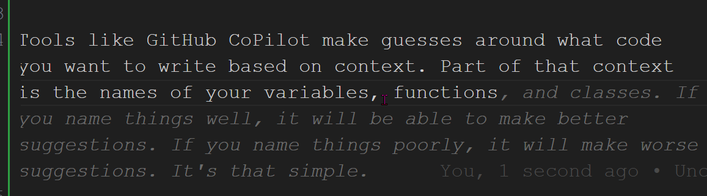

# Naming Things

- Why Care?
  - Communication is Key
  - Documentation
  - Human Memory
  - AI Integration
- Basics
  - Follow the Style Guide
  - Match the Business's Terms
  - Avoid Abbreviation or Lengthy Names
  - Consistency
- Details
  - Case
  - Singular and Plural
  - Verbs and Nouns

How important choosing names is in tech may be surprising. Keep in mind that in some cases, this is the only documentation you will get that explains what the thing does. Even if other docs are available, is it nice to skip reading it to make simple changes?

Human time is expensive, and a good name only takes a little more computer resources, even in languages that aren't optimized in the compiler.

## Why Care?

As with many of these topics, I first want to cover why naming things is vital to the development process. While the fact that you are reading this means you think that names have value, I'd like to solidify the reasons why names are such a powerful tool in coding.

### Communication is Key

As time goes on, developers and related disciplines become more efficient in writing and maintaining systems. In the past couple of years, AI-assisted development has become the latest tool generation in our toolbox. It adds to an already rich suite of languages, IDEs (Integrated Development Environments), and libraries that allow us to produce code faster than ever.

What's left for the human dev to do? Regardless of how you view ChatGPT's pretend expertise, developers still have a huge role in communicating ideas. A foundational element of communicating with other developers is naming things within the code. Another component of this is how these names interact with users- whether or not we effectively tell them how to use the system. In this case, we will only focus on naming things within the code base rather than on how to design a smooth user experience.

### Documentation

We use documentation to create a record of how a system works that doesn't require direct communication. Even future-you won't remember the design as clearly as you did while writing it. Documentation allows you to capture that information at its peak understanding.

Jobs are notorious for not allowing time for devs to write documentation. Even when they do, it takes work to maintain the discipline required. No matter how tight schedules are, you will always have one method of documentation available to you- how you name things. Some will argue that names are the only documentation needed. I have to disagree with that. Instead, I see them as a bare minimum bar to reach with code quality.

### Human Memory

While documentation is about more than function names, it is still essential. One way that it acts as helpful documentation is that a good name is easy to remember. Unrelated names, or worse, random strings, are tough to keep track of. Having to constantly double-check what something means interrupts the workflow, so we want to minimize it.

### AI Integration

Tools like GitHub CoPilot make guesses around what code you want to write based on context. Part of that context is the names of your variables, functions, and classes. If you name things well, it will be able to make better suggestions. On the flip side, if you name things poorly, it will make worse suggestions and you will need to do more work to correct it.

## Basics

### Follow the Style Guide

Most languages will publish a style guide with the rest of their docs. Many of the things we are about to discuss have a lot of similar options, and there is rarely a "right" answer.

Style guides give us a few things:

We don't have to expend mental energy trying to decide things like which letters to capitalize and can move on to more important things.
It gives us consistency across the industry (ideally).
The rules are written to help us create code that is easier to read.

### Match the Business's Terms

Every business has its own unique terminology. Sometimes we disagree with how other parts of a business name things. Even when you do, use the silly term marketing came up with in your code. It means fewer things for a new team member to learn and less for you to remember. In addition, using different terms means you will constantly have to "translate" ideas when talking with other parts of the business.

### Avoid Abbreviation or Lengthy Names

#### Abbreviation

Abbreviations cause issues since it's more information for you to remember, assuming you can even remember what it stands for. It can also make renaming things more challenging as you have to search for both the full name and all abbreviated versions. There is an exception here for abbreviations we've adopted industry-wide. Str for string, arr for array, and i for a loop index are all so common that it's unlikely that people will misunderstand what they are for.

I"m going to pick on Ruby a bit when it comes to abbreviation since it's my most recent source of frustration. In Ruby, we have a set of methods for simple type conversion: `to_a`, `to_s`, `to_i`, etc. Looking at this as someone new to Ruby, I can figure out that they change the variable type. Still, it isn't immediately obvious what they are switching to. Once you know that it is array, string, and integer it's easy to see what is happening, but there is an understanding barrier there. I would argue for the slightly longer 'to_arr', 'to_str', and 'to_int', but those have a slightly different use in Ruby, making things even more complicated to remember.

#### Lengthy Names

You want to remain balanced with name length. A name that is too short won't give enough information to easily see what something is, but a name that is too long will be hard to read and type. You don't need to convey every detail in the name, but if something is hard to describe in a few words, it may be time to break it apart into separate classes or functions.

Java is famous for its extremely long naming patterns. A great example is in the popular Spring framework: [`SimpleBeanFactoryAwareAspectInstanceFactory`](https://docs.spring.io/spring-framework/docs/current/javadoc-api/org/springframework/aop/config/SimpleBeanFactoryAwareAspectInstanceFactory.html). Once you break it down, it can make sense. `Simple` is a default implementation that implements the `BeanFactoryAware` and `AspectInstanceFactory` interfaces. Good luck saying or typing it correctly on the first try, though.

### Consistency

Consistency might be the most essential item on the list. Especially with the detailed things we are about to go over, consistency within the codebase is more important than the style guide or personal preference. It's simply more efficient if everyone does things the same way.

## Details

### Case

In the era of syntax highlighting, it's easy to tell what is a class, function, or object since they are displayed in different colors. These colors are only sometimes available, and your IDE may make mistakes. Case is one tool we use to show what kind of item is that isn't reliant on outside tools.

Case refers to how we use capitalization and symbols to distinguish multiple word names. Which one to use for each type is usually one of the things outlined in the language's style guide. Despite plenty of commentary and even some [research papers](http://www.cs.loyola.edu/~binkley/papers/icpc09-clouds.pdf) there is no single rule on the best way to do this.

There are four main types in current usage:

PascalCase, where the first letter of every word is capitalized
camelCase leaves the first letter lowercase and capitalizes the rest
kebab-case, used in URLs, is all lowercase with dashes between each letter
snake_case is the save as kebab-case but uses an underscore instead of a dash

Also worth noting is that it is common to use all caps for special variables like environment variables and constants. Regardless of other language conventions, these usually use snake_case to distinguish different words in the name.

### Singular or Plural

When deciding between singular and plural names, the basic rule is to match the value represented. A single `Cat` object might be named `myCat`, whereas an array of cats at the shelter might be named `shelterCats`. Since this can be confusing (`shelterCat` versus `shelterCats`) there is an argument for using something like Hungarian notation (*) to denote collections. As always, consult the style guide to determine what to use.

\* Hungarian notation is the practice of including the type in the name. So in this case you might use `shelterCat` and `shelterCatList` to distinguish them.

### Verbs and Nouns

When naming data, we use nouns as our foundation, with adjectives to clarify. In the above example, `myCat` and `shelterCats` use the object type as the base noun (Cat) with a descriptor to communicate what the variable contains.

Verbs are usually reserved for function names and most function names should have a verb. Generally, a function name will follow the format `{verb describing action}{noun for what is being acted on}`. The simplest of these are get and set methods. My `Cat` class may have a property called `name`, and I interact with that using `getName()` and `setName()`.

## Wrapping Up

Even minor things like capitalization convey meaning in code, so we use care when utilizing them. Larger items like terminology significantly impact how readable the code is. In the end, every single character in the name should convey important information that creates the foundation layer of our documentation.
